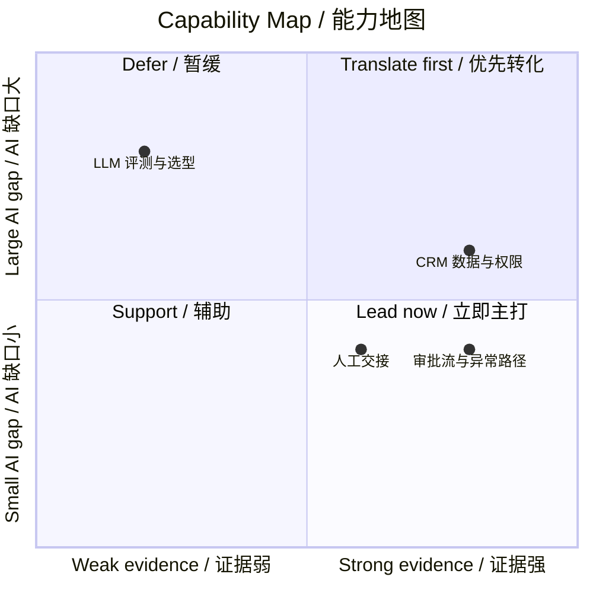

# Sample Core Diagnosis / 核心诊断示例

This illustrates the output of `$ai-career-transition-planner` only. It intentionally stops before generating a learning plan, case deep dive, or interview script.

本示例仅展示 `$ai-career-transition-planner` 的核心诊断输出，刻意停在学习计划、案例深挖和面试稿之前。

## Input / 输入

> 我做了 3 年传统 B 端 SaaS 产品经理，负责审批流和 CRM，没有 AI 经验。想转 AI Agent 产品经理，也愿意投 AI 应用产品岗位。

## 1. Role directions and Path Fit Score / 职业方向与路径匹配分

| Role direction / 职业方向 | Evidence 35 | Domain assets 25 | Evidence Readiness /60 | JD fit 25 | Closability 15 | Path Fit /100 | Confidence / 置信度 | Recommendation / 建议 |
|---|---:|---:|---:|---:|---:|---:|---|---|
| AI Agent Product Manager | 28 | 22 | 50 | N/A | N/A | N/A | Medium | 主攻：工作流、状态、异常和人工交接经历最匹配。 |
| AI Application Product Manager | 27 | 20 | 47 | N/A | N/A | N/A | Medium | 备选：可扩大投递面，仍可复用同一证据。 |
| AI UX / Conversation Design | 15 | 13 | 28 | N/A | N/A | N/A | Low | 暂不主攻：缺少直接 UX 证据。 |

**Positioning / 一句话定位:** 具备企业审批、CRM 数据模型、权限和异常处理经验的 SaaS 产品经理，正在将确定性流程设计能力迁移到 AI 辅助任务编排、评测和人机协作边界设计。

**Score note / 评分说明:** 未提供 JD 和时间约束，因此只显示“证据准备度 /60”，不展示完整路径匹配分。该分数用于比较已有证据与领域资产，不是获得 Offer 的概率。

## 2. Evidence, domain-asset, and gap map / 经历、领域资产与短板地图

### Direct matches / 直接匹配

- 设计过多角色审批流、状态流转和异常升级路径。
- 负责过 CRM 字段、状态定义和权限规则。
- 与销售、运营和研发协调过人工交接。

### Domain assets / 领域资产

| Asset / 资产 | What is known / 已掌握内容 | AI product implication / AI 产品含义 |
|---|---|---|
| 客户记录 | 客户状态、负责人、商机阶段、跟进记录 | 可定义检索范围和工具查询字段；需验证权限、时效和敏感数据。 |
| 审批 SOP | 提交条件、角色、阈值、升级路径 | 关键规则应保持确定性；AI 可辅助摘要或风险提示，不能绕过审批。 |

### Capability coordinate map / 能力坐标地图

| Capability / 能力 | Evidence X | AI gap Y | Interpretation / 解读 | Action / 行动 |
|---|---:|---:|---|---|
| 审批流、状态与异常路径 | 4 | 2 | 右下：可作为主打能力 | 补 Agent 状态与失败重试语言。 |
| CRM 数据模型与权限 | 4 | 3 | 右上：强领域资产，待 AI 转化 | 练习检索、工具调用与数据时效的判断。 |
| 人工交接与协作 | 3 | 2 | 右下：支持 Human-in-the-loop 叙事 | 补接管阈值和接管率指标。 |
| LLM 评测与选型 | 1 | 4 | 左上：高优先级短板 | 优先补质量、延迟、成本和评测。 |

## 3. Priority gaps and claim boundaries / 优先短板与主张边界

| Priority / 优先级 | Gap or claim boundary / 短板或边界 | Why it matters / 原因 | Recommended next step / 推荐下一步 |
|---|---|---|---|
| P0 | 概率性系统、Guardrails 与人工接管 | AI PM 面试高频考察它和传统工作流的差异。 | 学习冲刺计划。 |
| P0 | 质量、延迟、成本与评测 | 面试官会追问 AI 方案为何值得做及如何取舍。 | 学习冲刺计划。 |
| Boundary | 没有真实 AI Agent 上线经验 | 不应声称负责过 Agent 上线。 | 将一个真实审批流用案例 Skill 作 AI 化推演。 |

## 4. Career Proof Map / AI 职业证据地图

> **Target:** AI Agent Product Manager · **Evidence Readiness:** 50/60 · **Confidence:** Medium
>
> **Positioning:** 把企业审批、CRM 数据模型、权限与异常处理能力，迁移到可靠的 AI 辅助任务编排与人机协作设计。
>
> **Lead with:** 审批流和异常路径 · CRM 数据模型与权限 · 人工交接流程
>
> **Translate next:** CRM/SOP → 检索边界、工具输入输出、确定性 Guardrails
>
> **Build next:** LLM 评测与模型选型的质量、延迟、成本语言
>
> **One next action:** 用 `$ai-career-sprint-plan` 补 AI 产品决策基础。

## 5. Recommended follow-up / 推荐下一步

**Recommended Skill / 建议使用的 Skill:** `$ai-career-sprint-plan`

**Reason / 原因:** 已有可主打的企业流程与领域资产，当前最高杠杆是补足 AI 产品的核心决策语言，而不是再做大型作品。

**Prompt / 可直接继续的指令:** `Use $ai-career-sprint-plan to create a 10-working-day plan from this diagnosis. I can study 90 minutes per day.`
