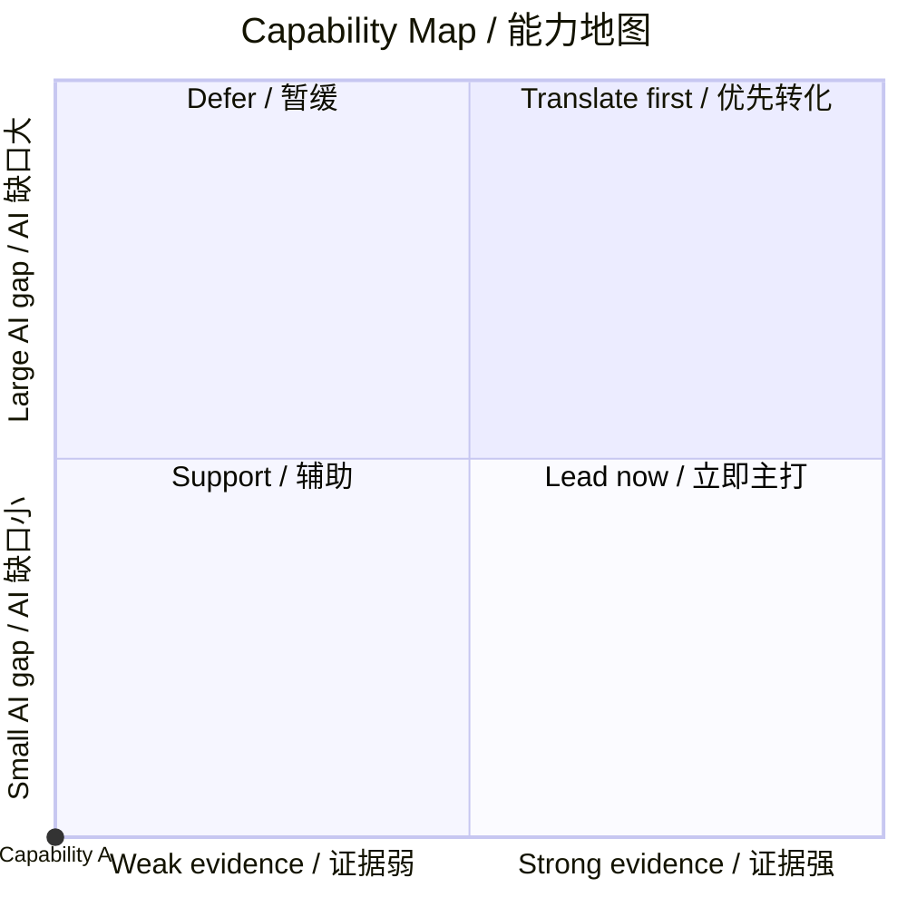

# Career Diagnosis / 职业诊断

## 1. Role directions and Path Fit Score / 职业方向与路径匹配分

| Role direction / 职业方向 | Evidence 35 | Domain assets 25 | Evidence Readiness /60 | JD fit 25 | Closability 15 | Path Fit /100 | Confidence / 置信度 | Recommendation / 建议 |
|---|---:|---:|---:|---:|---:|---:|---|---|
| Primary / 主攻 |  |  |  | `N/A if no JD` | `N/A if time unknown` | `N/A unless all inputs exist` |  |  |
| Adjacent / 备选 |  |  |  | `N/A if no JD` | `N/A if time unknown` | `N/A unless all inputs exist` |  |  |

- **Positioning statement / 一句话定位:**
- **Score caveat / 评分说明:** Evidence Readiness compares existing proof and domain assets. Path Fit is only shown when both a target JD and a realistic time constraint are supplied. Neither is a hiring probability.

## 2. Evidence, domain-asset, and gap map / 经历、领域资产与短板地图

### Direct matches / 直接匹配

### Transferable capabilities / 可迁移能力

### Domain data and SOP assets / 领域数据与 SOP 资产

| Asset / 资产 | What is known / 已掌握内容 | AI product implication / AI 产品含义 |
|---|---|---|
|  |  |  |

### Capability coordinate map / 能力坐标地图

| Capability / 能力 | Evidence strength X (0–5) | AI-specific gap Y (0–5) | Evidence and rationale / 证据与理由 | Action / 行动 |
|---|---:|---:|---|---|
|  |  |  |  |  |

## 3. Priority gaps and claim boundaries / 优先短板与主张边界

| Priority / 优先级 | Gap or claim boundary / 短板或边界 | Why it matters / 原因 | Recommended next step / 推荐下一步 |
|---|---|---|---|
| P0 |  |  |  |

## 4. Recommended follow-up / 推荐下一步

- **Recommended Skill / 建议使用的 Skill:**
- **Reason / 原因:**
- **Prompt / 可直接继续的指令:**
